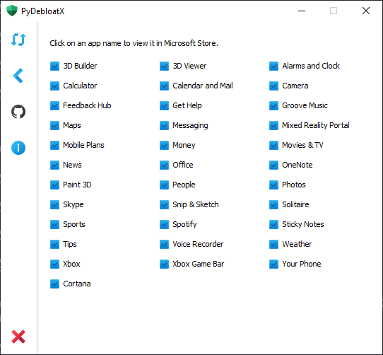

<p align="center">
  
</p>
<h1 align="center">
  PyDebloatX
</h1>

<p align="center">
    A Python GUI for uninstalling the default Windows 10 apps.
</p>

<p align="center">
  <a style="text-decoration:none" href="https://github.com/Teraskull/PyDebloatX/releases">
    
  </a>
  <a style="text-decoration:none" href="https://www.python.org/downloads/release/python-379/">
    
  </a>
  <a style="text-decoration:none" href="https://www.codefactor.io/repository/github/teraskull/pydebloatx">
    
  </a>
  <a style="text-decoration:none" href="https://github.com/Teraskull/PyDebloatX/releases">
    
  </a>
  <a style="text-decoration:none">
    
  </a>
</p>

<div align="center">




</div>


<details open="open">
  <summary>Table of Contents</summary>
  <ol>
    <li><a href="#installing">Installing</a></li>
    <li><a href="#shortcuts">Shortcuts</a></li>
    <li><a href="#features">Features</a></li>
    <li><a href="#dependencies">Dependencies</a></li>
    <li><a href="#usage">Usage</a></li>
    <li><a href="#building">Building</a></li>
    <li><a href="#translating">Translating</a></li>
    <li><a href="#supported-languages">Supported Languages</a></li>
    <li><a href="#license">License</a></li>
  </ol>
</details>

## Installing
Pre-built binaries are available from the [releases](https://github.com/Teraskull/PyDebloatX/releases) page.

PyDebloatX installer is also available from the Windows Package Manager [Winget](https://github.com/microsoft/winget-cli):

```powershell
winget install --id=Teraskull.PyDebloatX -e
```

## Shortcuts

* <kbd>CTRL</kbd> <kbd>R</kbd> - refresh the list of installed apps.
* <kbd>CTRL</kbd> <kbd>S</kbd> - view links to apps in Microsoft Store.
* <kbd>CTRL</kbd> <kbd>G</kbd> - visit the GitHub page.
* <kbd>CTRL</kbd> <kbd>A</kbd> - view the "About" window.
* <kbd>CTRL</kbd> <kbd>Q</kbd> - quit the app.

## Features

* Intuitive design allows to easily navigate through the GUI and uninstall apps with a few clicks.
* It is not possible to break the OS using this tool. All listed apps can be reinstalled with Microsoft Store using the "Store" sidebar tab. Apps like Edge or Cortana are deeply integrated with Windows 10, so they cannot be easily uninstalled without creating any issues.
* The GUI does not require elevated administrator privileges to run. It also does not save registry entries.

## Dependencies

* [PySide6](https://pypi.org/project/PySide6/)
* [requests](https://pypi.org/project/requests/)
* [packaging](https://pypi.org/project/packaging/)

## Usage

```batch
git clone https://github.com/Teraskull/PyDebloatX

cd PyDebloatX

pip install -r requirements.txt

cd pydebloatx

python app.py
```

## Building

Run `setup.bat` to build the executable.

Run `setup-portable.bat` to build a one-file portable executable.


## Translating

Run the following command to create the translation file:
```batch
lupdate gui_main.py gui_about.py app.py -ts Language/[locale_CODE].ts
```

Where `[locale_CODE]` is written with an underscore, instead of a hyphen. For example, `en_US`.

List of locale codes is available [here](http://www.lingoes.net/en/translator/langcode.htm).

To compile `.ts` into `.qm`, use `linguist.exe`:

```batch
pip show PySide6 | findstr "Location:"
```

Splice the output path above with:

```batch
"\PySide6\linguist.exe"
```

## Supported Languages
|Language|Author credits|
|---|---|
|[Arabic](https://github.com/Teraskull/PyDebloatX/blob/master/pydebloatx/Language/ar_SA.ts)|[FaresAhmedb](https://github.com/FaresAhmedb/)|
|[Chinese](https://github.com/Teraskull/PyDebloatX/blob/master/pydebloatx/Language/zh_CN.ts)|[space9bug](https://github.com/space9bug/)|
|[English](https://github.com/Teraskull/PyDebloatX/blob/master/pydebloatx/Language/en_US.ts)|[Teraskull](https://github.com/Teraskull/)|
|[Russian](https://github.com/Teraskull/PyDebloatX/blob/master/pydebloatx/Language/ru_RU.ts)|[Teraskull](https://github.com/Teraskull/)|
|[Ukrainian](https://github.com/Teraskull/PyDebloatX/blob/master/pydebloatx/Language/uk_UA.ts)|[Teraskull](https://github.com/Teraskull/)| 


## License

This software is available under the following licenses:

  * **MIT**
